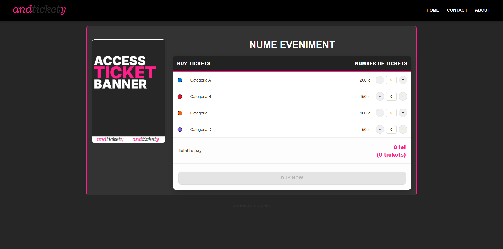
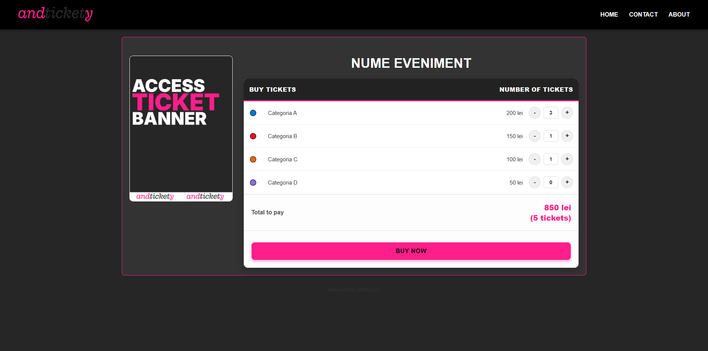
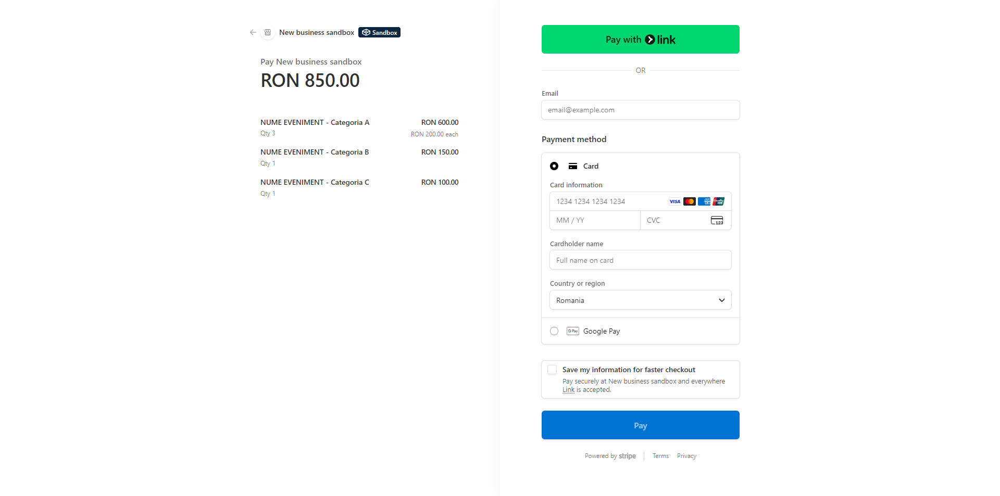
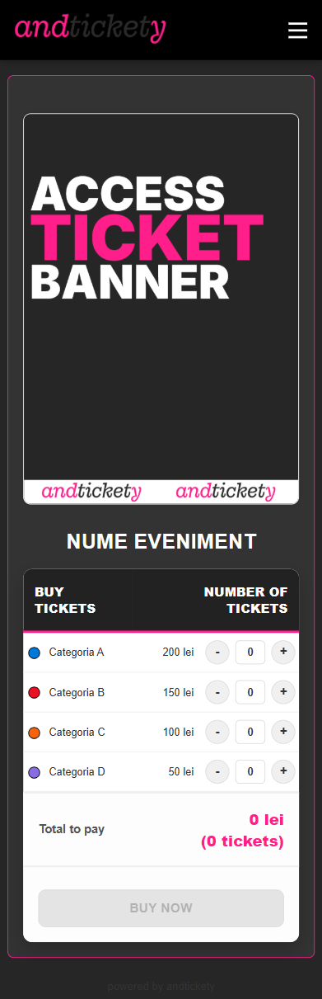
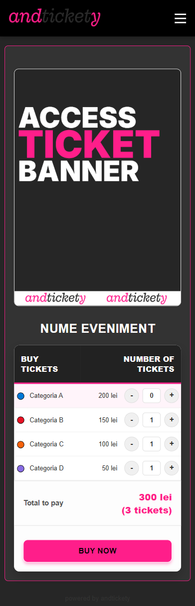

# andtickety

[](index.php)

andtickety is a lightweight, open-source ticketing system for "static destination" use-cases — museums, galleries, zoos, tours, rides, and other small to medium events where site operators want simple ticket sales and QR-based entry.

This repository contains a minimal PHP app that:

- Lets users view event details and pick ticket categories
- Uses Stripe Checkout for secure payments
- Generates unique ticket codes stored in an SQLite DB
- Sends a purchase email using PHPMailer with a link to view / download tickets
- Provides QR generation (local or via API) for each ticket

---

## Screenshots

Web interface (desktop):





Mobile preview:




---

## Table of contents

1. [Quick start](#quick-start)
2. [Requirements](#requirements)
3. [Installation](#installation)
4. [Configuration](#configuration)
5. [Event data / tickets structure](#event-data--tickets-structure)
6. [Stripe setup & webhook](#stripe-setup--webhook)
7. [Email (PHPMailer) setup](#email-phpmailer-setup)
8. [SQLite database](#sqlite-database-schema)
9. [How the flow works (high level)](#how-the-flow-works-high-level)
10. [Security & deployment notes](#security--deployment-notes)
11. [Troubleshooting](#troubleshooting)
12. [Contributing & license](#contributing--license)

---

## Quick start

1. Clone this repository to a PHP-capable web host.
2. Add your configuration values in `include/configuration/config.php` (Stripe keys, site URL, mail settings).
3. Set a Stripe webhook endpoint (point to `<YOUR_SITE>/stripe_webhook.php`) and add `checkout.session.completed` as an event.
4. Make sure `include/event_info.json` contains the events and ticket categories you want to sell.

Open your site root (usually `index.php`) in the browser and test the purchase flow using Stripe test keys.

---

## Requirements

- PHP 7.4+ (or compatible) with PDO + SQLite support
- A writable `include/database/` folder for the SQLite file (or a writable `logs/` folder)
- A publicly reachable domain (for Stripe webhooks to send events)

---

## Installation

1. Place the project on your web server (document root or a subfolder).
2. Ensure the server has write access to the `include/database` and `logs` folders.
3. Review and update `include/configuration/config.php` with values for your environment (see the next section).
4. Make sure the following files/folders are present and readable: `include/phpqrcode`, `include/PHPMailer-7.0.1`, and `include/stripe-php-19.0.0`.

---

## Configuration

All runtime configuration lives in `include/configuration/config.php`.

Important configuration variables (example values):

```php
$site_name = 'andtickety';
$site_description = 'Your all-in-one ticketing solution';
$site_url = 'https://your-domain.example';

$currency = 'RON';
$currency_symbol = 'lei';

// STRIPE
$secret_key_stripe = 'sk_test_x';
$endpoint_secret_stripe = 'whsec_y';

// EMAIL / SMTP (PHPMailer)
$mail_name       = $site_name;
$mail_host       = 'mail.domain.com';
$mail_username   = 'no-reply@domain.com';
$mail_password   = 'supersecret';
$mail_smtpSecure = 'ssl';
$mail_port       = 465;
```

Notes:
- Replace `sk_test_x` with your Stripe secret key (test or live depending on environment).
- `endpoint_secret_stripe` is the **signing secret** created when you add the webhook in your Stripe dashboard (used to validate incoming webhook events).
- Do **not** commit or share private keys or passwords publicly — use environment variables in production wherever possible.

---

## Event data / tickets structure

Tickets and events are driven by `include/event_info.json`. Example structure:

```json
[
  {
    "id": "evt_001",
    "event_name": "My Event Name",
    "tickets": {
      "category_a": { "name": "Adult", "price": 200 },
      "category_b": { "name": "Child", "price": 100 }
    },
    "max_tickets_per_category": 5,
    "images": ["assets/images/event/BANNER1.PNG", "assets/images/event/BANNER2.PNG"]
  }
]
```

- `id` should be unique per event (used as `event_id` metadata in Stripe).
- Each ticket entry uses a key (`category_a`, `category_b`) used by the frontend and the Stripe metadata (`ticket_type`).

---

## Stripe setup & webhook

1. Create products/prices or let the app create line items on the fly (this app uses `price_data` when creating the Checkout session).
2. Use `actions/create_checkout.php` — it collects the chosen items and calls the Stripe Checkout API.
3. Configure an endpoint in Stripe dashboard under Developers → Webhooks → Add endpoint pointing to:

   `https://<your-domain>/stripe_webhook.php`

4. Add the event `checkout.session.completed` and copy the **signing secret** value into `endpoint_secret_stripe` in `include/configuration/config.php`.

What the webhook does (overview):
- Validates the event with the provided signing secret.
- On `checkout.session.completed`, fetches session line items and creates unique ticket codes.
- Stores tickets and customer info in the SQLite DB and sends an email with a link to `actions/succes_stripe.php?session_id=...`.

Important notes:
- Webhooks must be reachable by Stripe (public URL and HTTPS recommended).
- The webhook verifies signatures — do not bypass that check.

---

## Email (PHPMailer) setup

The project uses PHPMailer (bundled in `include/PHPMailer-7.0.1`) to send purchase confirmation emails.

Configure SMTP settings in `include/configuration/config.php`:
- `$mail_host` : your SMTP host
- `$mail_username` : SMTP username / from-address
- `$mail_password` : SMTP password
- `$mail_port` : SMTP port (465 for SSL, 587 for TLS)
- `$mail_smtpSecure` : `ssl` or `tls`

The webhook sends an HTML email containing a direct link to the generated tickets and a CTA button. Error logs for email failures are written to `logs/mail_error.log`.

---

## SQLite database

This project stores tickets and customers in an SQLite database file (default path: `include/database/site.db`). 

---

## How the flow works (high level)

1. User selects tickets on the `home.php` (home page) UI built from `include/event_info.json`.
2. The form posts to `actions/create_checkout.php`, which builds Stripe Checkout session line items and starts the Stripe Checkout flow.
3. User pays using Stripe Checkout (hosted Stripe page). After successful payment, Stripe redirects to `actions/succes_stripe.php?session_id=...`.
4. Stripe sends a `checkout.session.completed` webhook to `stripe_webhook.php`. The webhook verifies the event, writes tickets and customer data to the SQLite DB, and emails the user with a link and QR codes.
5. `actions/succes_stripe.php` fetches ticket records from the DB using `session_id` and renders ticket cards with QR images generated by `actions/generate_qr.php` (or you can use an external QR API).

---

## Security & deployment notes

- Never commit your Stripe secret keys or SMTP passwords to a public repo.
- Prefer environment-based configuration in production (e.g., read values from $_ENV, .env, or system environment instead of a static `config.php` file).
- Keep `stripe_webhook.php` accessible only to Stripe if possible (whitelisting by IP is non-trivial for Stripe — rely on signature verification).
- Run the site under HTTPS for any production deployment.

---

## Troubleshooting

- Webhook shows 400: verify `endpoint_secret_stripe` matches the signing secret in the Stripe dashboard.
- Emails not sending: verify SMTP settings in `include/configuration/config.php` and check `logs/mail_error.log`.
- Tickets not showing on success page: ensure your SQLite `site.db` exists and the `tickets` table exists; check `logs/db_error.log`.

---

## Optional improvements & TODO

- Move secrets out of PHP files and into environment variables or a secrets manager.
- Add full unit tests and CI checks for critical flows.
- Add admin panel for viewing/marking ticket usage.
- Add method to revoke or expire codes (expiration logic currently stores numeric value in `expire_date`).

---

## Contributing

Contributions welcome — please open a pull request or raise issues for bugs & features.

Before opening a PR, ensure you:
- Explain the change in the PR description
- Keep secrets out of commits
- Add tests where applicable

---

## License

This project is open-source. If there is a specific license you intended to use, add a LICENSE file. Otherwise, include the license header you want to use for redistributing this project.

---

